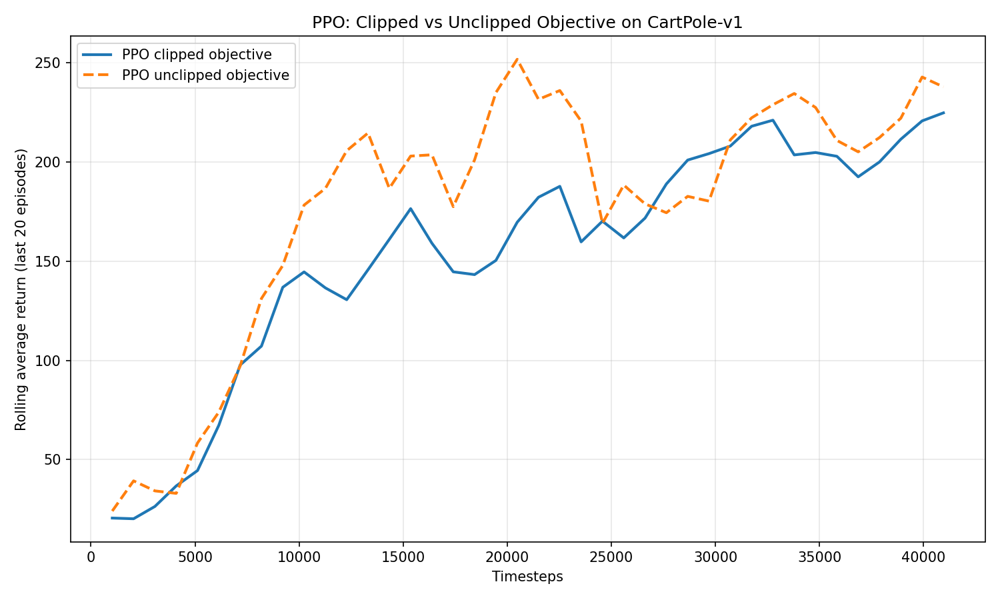
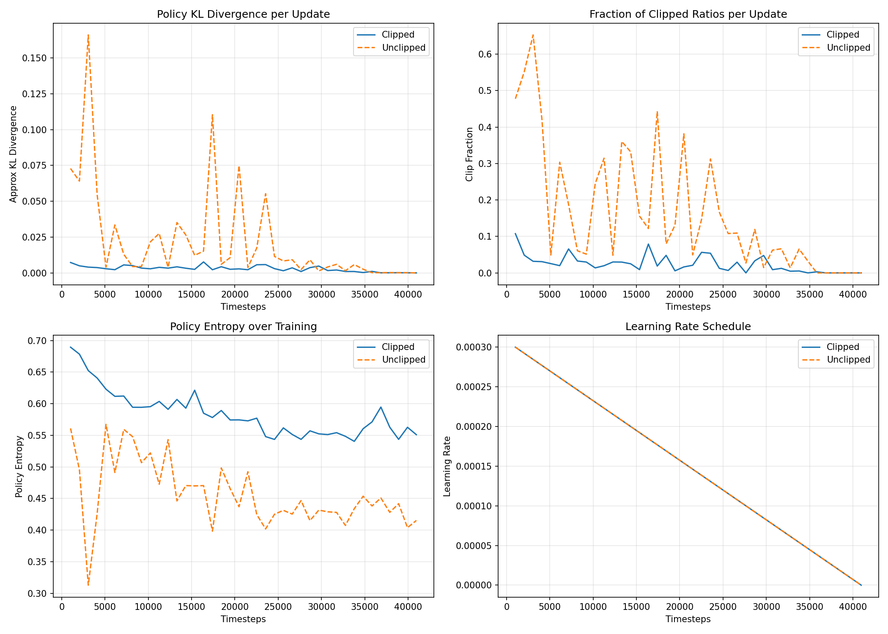

# Assignment 4 — PPO from Scratch

Implementation of **Proximal Policy Optimization (PPO)** from scratch on `CartPole-v1` (Gymnasium), comparing the **clipped** vs **unclipped** policy objective.

## Results

### Tuned Run (120k timesteps)

| Variant | Final Avg Return (last 20 eps) | Deterministic Eval — 50 eps |
|---|---|---|
| Clipped PPO | 407.85 | **497.38 ± 12.87** |
| Unclipped PPO | 437.35 | 500.00 ± 0.00 |

CartPole-v1 maximum is 500. Clipped PPO reaches near-optimal consistently; unclipped reaches 500 in this run but collapses intermittently — the multi-seed results below show the instability.

### Multi-Seed Robustness (80k timesteps, 3 seeds)

| Seed | Clipped Eval | Unclipped Eval |
|---|---|---|
| 101 | 500.00 | 500.00 |
| 202 | 372.90 | 432.90 |
| 303 | 483.40 | 412.53 |
| **Mean** | **452.10 ± 56.41** | **448.48 ± 37.37** |

Clipped training return mean: **368.90** vs Unclipped: **297.82**. Clipped is more stable during training even when final eval scores are comparable.

### Baseline Run (40k timesteps)

| Variant | Final Avg Return | Deterministic Eval — 30 eps |
|---|---|---|
| Clipped PPO | 224.85 | **466.17 ± 59.20** |
| Unclipped PPO | 237.95 | 357.90 ± 105.19 |

Unclipped has 2× higher std in eval — clear instability signature.

---

## Plots

### Learning Curves — Clipped vs Unclipped (120k)


### Diagnostic Plots — KL Divergence, Clip Fraction, Entropy, LR Schedule (120k)


The KL divergence panel shows the core difference: unclipped PPO makes large policy updates (KL spikes to ~0.18) while clipped PPO stays under 0.01 throughout — this is why clipping stabilises training.

### Learning Curves — Baseline 40k Run



### Diagnostic Plots — Baseline 40k Run



---

## PPO Components Implemented

All procedures are implemented from scratch in `ppo_from_scratch.py`:

1. **Policy network (Actor)** — 2-layer MLP, Tanh activations, categorical action distribution
2. **Value network (Critic)** — separate 2-layer MLP, scalar output
3. **Rollout generation** — fixed-horizon collection with pre-allocated numpy buffers
4. **Reward handling and return estimation** — bootstrapped GAE returns
5. **Advantage estimation (GAE)** — reverse sweep with γ and λ
6. **PPO objective** — clipped (`min(r·A, clip(r,1±ε)·A)`) and unclipped (`r·A`) variants
7. **Linear LR annealing** — decays learning rate to zero over training (PPO paper default)
8. **KL divergence tracking** — approximate KL per update for diagnostics
9. **Diagnostic plots** — KL, clip fraction, entropy, LR schedule over training

---

## Project Structure

```
Assignment 4/
├── ppo_from_scratch.py          # Full PPO implementation
├── requirements.txt
├── report.md                    # Full assignment report with findings
├── hyperparameter_analysis.md   # Hyperparameter tuning notes
├── outputs/                     # Default 40k run
├── outputs_new/                 # Baseline run with diagnostics
├── outputs_tuned_120k_v2/       # Tuned 120k run (main results)
├── outputs_tuned_seed_101/      # Robustness seed 101
├── outputs_tuned_seed_202/      # Robustness seed 202
└── outputs_tuned_seed_303/      # Robustness seed 303
```

---

## Setup

```bash
pip install -r requirements.txt
```

## Run

**Default (40k timesteps):**
```bash
python ppo_from_scratch.py --env CartPole-v1 --timesteps 40000 --output-dir outputs
```

**Tuned near-optimal (120k timesteps):**
```bash
python ppo_from_scratch.py \
  --env CartPole-v1 \
  --timesteps 120000 \
  --rollout-steps 2048 \
  --epochs 10 \
  --minibatches 8 \
  --lr 0.00025 \
  --gamma 0.99 \
  --gae-lambda 0.95 \
  --clip-coef 0.2 \
  --ent-coef 0.0 \
  --vf-coef 0.5 \
  --max-grad-norm 0.5 \
  --hidden-size 64 \
  --eval-episodes 50 \
  --output-dir outputs_tuned_120k
```

**Render environment during training:**
```bash
python ppo_from_scratch.py --env CartPole-v1 --timesteps 20000 --render --output-dir outputs
```

**Disable LR annealing:**
```bash
python ppo_from_scratch.py --no-anneal-lr --output-dir outputs
```

---

## Hyperparameters

| Parameter | Default | Tuned |
|---|---|---|
| `learning_rate` | 3e-4 | 2.5e-4 |
| `rollout_steps` | 1024 | 2048 |
| `update_epochs` | 10 | 10 |
| `num_minibatches` | 8 | 8 |
| `clip_coef` (ε) | 0.2 | 0.2 |
| `ent_coef` | 0.01 | 0.0 |
| `vf_coef` | 0.5 | 0.5 |
| `gamma` (γ) | 0.99 | 0.99 |
| `gae_lambda` (λ) | 0.95 | 0.95 |
| `max_grad_norm` | 0.5 | 0.5 |
| `hidden_size` | 64 | 64 |
| `anneal_lr` | True | True |

Key tuning decisions:
- `rollout_steps=2048` improves advantage quality over 1024
- `lr=2.5e-4` more stable than 3e-4 at 120k steps
- `ent_coef=0.0` helps late-stage convergence on CartPole once exploration is no longer needed

---

## Key Findings

1. **Clipping stabilises training** — KL divergence stays under 0.01 with clipping vs spikes to 0.18 without
2. **Unclipped is higher variance** — eval std is 2× higher across seeds and runs
3. **Both can solve CartPole** — but clipped does so more reliably across seeds
4. **LR annealing helps** — clip fraction naturally drops to 0 in later updates as LR shrinks, preventing unnecessary gradient noise near convergence
