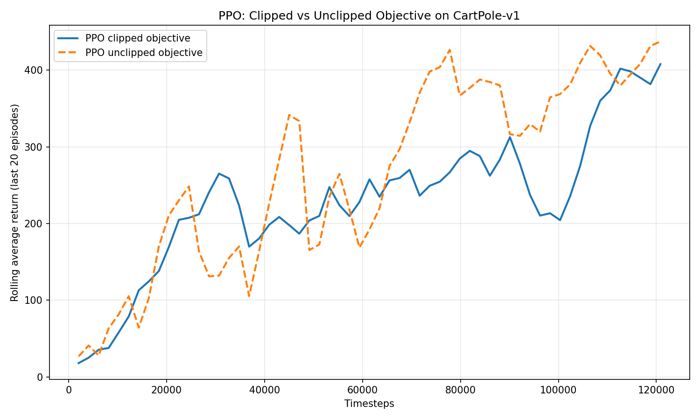
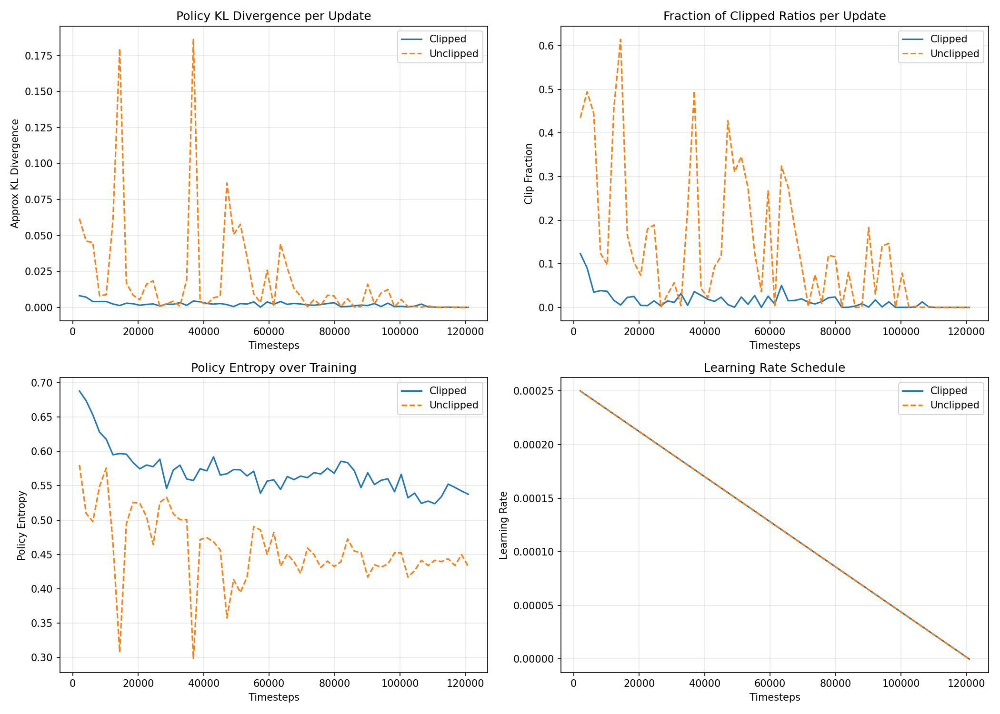

# Assignment 4 — PPO from Scratch

Implementation of **Proximal Policy Optimization (PPO)** from scratch on `CartPole-v1` (Gymnasium), comparing the **clipped** vs **unclipped** policy objective.

---

## Results

### Main Run — 120k Timesteps (Tuned, Seed 42)

| Variant | Final Avg Return (last 20 eps) | Deterministic Eval — 50 eps |
|---|---|---|
| Clipped PPO | 407.85 | **497.38 ± 12.87** |
| Unclipped PPO | 437.35 | 500.00 ± 0.00 |

CartPole-v1 maximum possible return is 500. Clipped PPO reaches near-optimal reliably; unclipped hits 500 here but collapses mid-training — the multi-seed results below reveal the instability.

### Multi-Seed Robustness — 80k Timesteps (3 Seeds)

| Seed | Clipped Eval | Unclipped Eval |
|---|---|---|
| 101 | 500.00 | 500.00 |
| 202 | 372.90 | 432.90 |
| 303 | 483.40 | 412.53 |
| **Mean** | **452.10 ± 56.41** | **448.48 ± 37.37** |

Clipped training return mean: **368.90** | Unclipped: **297.82**

Clipped is more stable during training even when final eval scores are comparable across seeds.

---

## Plots

### Learning Curves — Clipped vs Unclipped



### Training Diagnostics — KL Divergence, Clip Fraction, Entropy, LR Schedule



The KL divergence panel shows the core difference between the two variants:
- **Clipped PPO**: KL stays under 0.01 throughout training — policy updates are constrained
- **Unclipped PPO**: KL spikes to ~0.18 at step 14k and again at ~37k — large unconstrained policy jumps cause the visible performance collapses in the learning curve

---

## PPO Components Implemented

All procedures implemented from scratch in `ppo_from_scratch.py`:

1. **Policy network (Actor)** — 2-layer MLP (64 hidden), Tanh activations, Categorical distribution
2. **Value network (Critic)** — separate 2-layer MLP (64 hidden), scalar state-value output
3. **Rollout generation** — fixed-horizon collection, pre-allocated numpy buffers
4. **Reward handling and return estimation** — bootstrapped GAE returns
5. **Advantage estimation (GAE)** — reverse sweep: `A_t = δ_t + γλ·A_{t+1}`
6. **PPO clipped objective** — `L = E[min(r·A, clip(r, 1-ε, 1+ε)·A)]`
7. **Unclipped objective** — vanilla `L = E[r·A]` (importance-sampled policy gradient)
8. **Linear LR annealing** — decays learning rate linearly to zero over training (PPO paper default)
9. **KL divergence tracking** — approximate KL per update: `E[(r-1) - log(r)]`
10. **Diagnostic plots** — KL, clip fraction, entropy, LR schedule over training

---

## Project Structure

```
Assignment 4/
├── ppo_from_scratch.py          # Full PPO implementation
├── requirements.txt
├── report.md                    # Assignment report with findings
├── hyperparameter_analysis.md   # Hyperparameter tuning notes
└── outputs_final/               # Final run outputs (120k tuned)
    ├── ppo_clipped_vs_unclipped.png
    ├── ppo_diagnostics.png
    ├── results_summary.txt
    └── videos/
        ├── clipped_policy-episode-0.mp4
        ├── clipped_policy-episode-1.mp4
        ├── unclipped_policy-episode-0.mp4
        └── unclipped_policy-episode-1.mp4
```

---

## Setup

```bash
pip install -r requirements.txt
```

## Run

**Default (40k timesteps):**
```bash
python ppo_from_scratch.py --env CartPole-v1 --timesteps 40000 --output-dir outputs
```

**Tuned near-optimal (120k timesteps):**
```bash
python ppo_from_scratch.py \
  --env CartPole-v1 \
  --timesteps 120000 \
  --rollout-steps 2048 \
  --epochs 10 \
  --minibatches 8 \
  --lr 0.00025 \
  --gamma 0.99 \
  --gae-lambda 0.95 \
  --clip-coef 0.2 \
  --ent-coef 0.0 \
  --vf-coef 0.5 \
  --max-grad-norm 0.5 \
  --hidden-size 64 \
  --eval-episodes 50 \
  --output-dir outputs_final
```

**Render environment during training:**
```bash
python ppo_from_scratch.py --env CartPole-v1 --timesteps 20000 --render --output-dir outputs
```

**Disable LR annealing:**
```bash
python ppo_from_scratch.py --no-anneal-lr --output-dir outputs
```

---

## Hyperparameters

| Parameter | Default | Tuned (main run) |
|---|---|---|
| `learning_rate` | 3e-4 | **2.5e-4** |
| `rollout_steps` | 1024 | **2048** |
| `update_epochs` | 10 | 10 |
| `num_minibatches` | 8 | 8 |
| `clip_coef` (ε) | 0.2 | 0.2 |
| `ent_coef` | 0.01 | **0.0** |
| `vf_coef` | 0.5 | 0.5 |
| `gamma` (γ) | 0.99 | 0.99 |
| `gae_lambda` (λ) | 0.95 | 0.95 |
| `max_grad_norm` | 0.5 | 0.5 |
| `hidden_size` | 64 | 64 |
| `anneal_lr` | True | True |

Key tuning decisions:
- `rollout_steps=2048` — larger batches improve advantage quality and reduce noisy updates
- `lr=2.5e-4` — more stable than 3e-4 over 120k steps
- `ent_coef=0.0` — entropy bonus not needed once CartPole exploration is settled

---

## Key Findings

1. **Clipping stabilises training** — KL stays under 0.01 vs spikes to 0.18 without clipping
2. **Unclipped is higher variance** — eval std is 2× higher; visible collapse events mid-training
3. **Both can solve CartPole** — but clipped does so more reliably across seeds (452 vs 448 mean, lower training variance)
4. **LR annealing helps late-stage convergence** — clip fraction naturally drops to 0 as LR shrinks, preventing gradient noise near convergence
